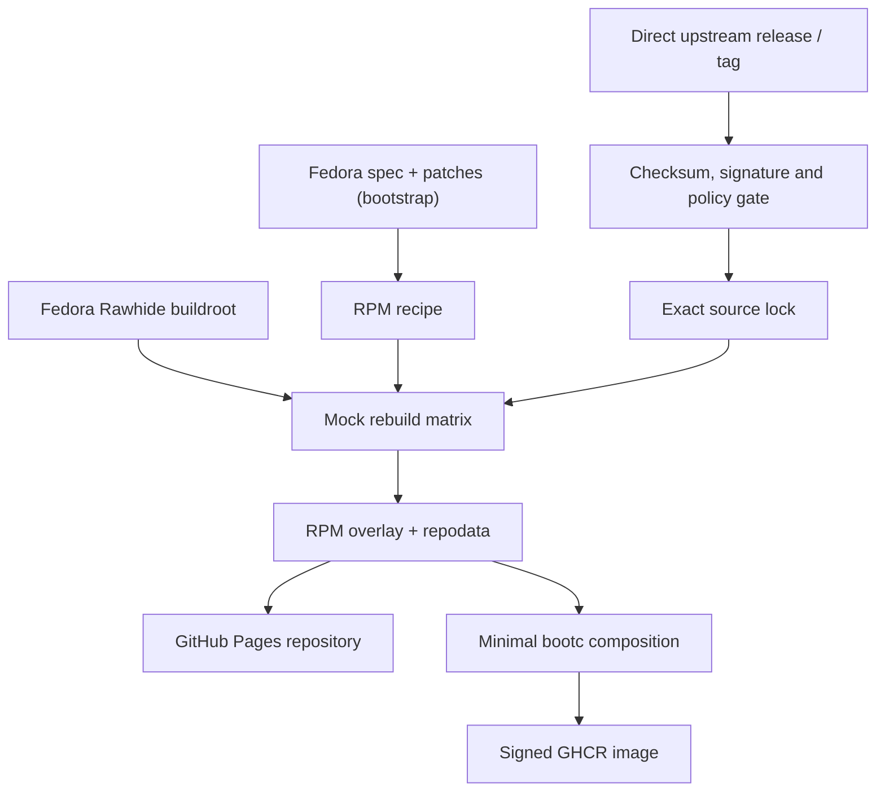

# Architecture

Fedora Rawhide supplies a temporary compatibility build root and initial RPM
recipes, never an update source or runtime package repository for consumer
images. Every RPM source payload is fetched from its configured upstream and
must pass the verification gate before it can reach Mock. The factory builds a
manifest-defined closure in shards on GitHub-hosted runners.

The workflow is lane-oriented rather than one monolithic stage barrier. The
normal stage lanes retain conservative repository ordering, while the
WebKitGTK lane runs independently after the stage-1 GTK/GStreamer inputs.
WebKitGTK itself is two shards of one recipe (`webkitgtk` builds the GTK 4
port, `webkit2gtk4.1` the GTK 3 port, via `rpm_defines` in the source
manifest and `tools/recipe.py`), so the two compiles that used to run back to
back on one runner run side by side on two. `gjs` is a late stage-2 lane
because it consumes mozjs140; evolution-data-server and gnome-shell are late
stage-3 consumers because they consume WebKitGTK and GJS. Each completed lane checkpoints its successful RPMs
into the internal `:building` candidate. The candidate is serialized across
all refs and is never published as the consumer `:latest` tag. Package build
identities include the source lock, recipe tree, factory policy, and pinned
Hummingbird base; missing or mismatched identities are rebuilt.

Rawhide is also the bootstrap escape hatch for a newly introduced Hummingbird
gap: its compiler, macros, and BuildRequires can establish the first RPM. Once
the factory has published that RPM, later Hummingbird builds use the factory
repository as a gap-filler for cross-package dependencies. Rawhide is never
consulted for an RPM's source archive and is never enabled in the consumer
image.
