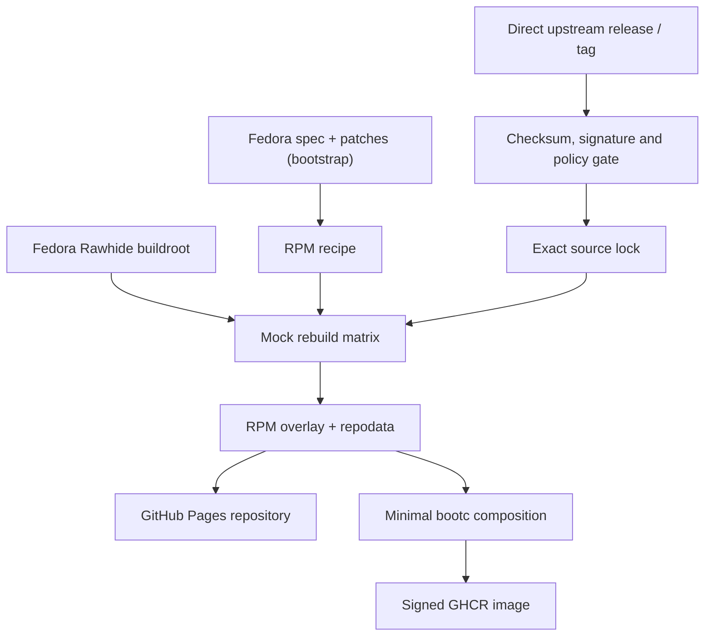

# Architecture

Fedora Rawhide supplies a temporary compatibility build root and initial RPM
recipes, never an update source or runtime package repository for consumer
images. Every RPM source payload is fetched from its configured upstream and
must pass the verification gate before it can reach Mock. The factory builds a
manifest-defined closure in shards on GitHub-hosted runners.

Rawhide is also the bootstrap escape hatch for a newly introduced Hummingbird
gap: its compiler, macros, and BuildRequires can establish the first RPM. Once
the factory has published that RPM, later Hummingbird builds use the factory
repository as a gap-filler for cross-package dependencies. Rawhide is never
consulted for an RPM's source archive and is never enabled in the consumer
image.

## Tooling

Where Packit CLI functionality (SRPM generation, spec-version-bump logic) is
useful in this factory's own automation, consume the upstream-published
`quay.io/packit/packit` image directly (it already ships `packit`, `mock`, and
`createrepo_c`, rebuilt daily by the Packit project) rather than maintaining a
local rebuild of it. Pin by digest. Do not reinvent an image upstream already
publishes and maintains.

`.github/workflows/packit-srpm-pilot.yml` proves this end-to-end: it runs the
verified-source pipeline and then `packit srpm --preserve-spec` against all 54
packages that carry a leftover, inherited Fedora `.packit.yaml`, using a
root-level `.packit.yaml` monorepo config. The locked upstream archive and any
Fedora lookaside sources are staged beside the spec before Packit runs, and the
root config's `create-archive` action makes Packit reuse the staged Source0
instead of replacing it with a Git archive. The workflow verifies every staged
source again after Packit runs, then uploads the resulting SRPMs as build
artifacts. It is a verification-only lane — it does not feed Mock, the RPM
overlay, or the published repository, and it does not touch
`rebuild-rpms.yml`. See
[`docs/superpowers/specs/2026-09-05-packit-srpm-pilot-design.md`](superpowers/specs/2026-09-05-packit-srpm-pilot-design.md)
for the original pilot scope and what a full migration would still need.
