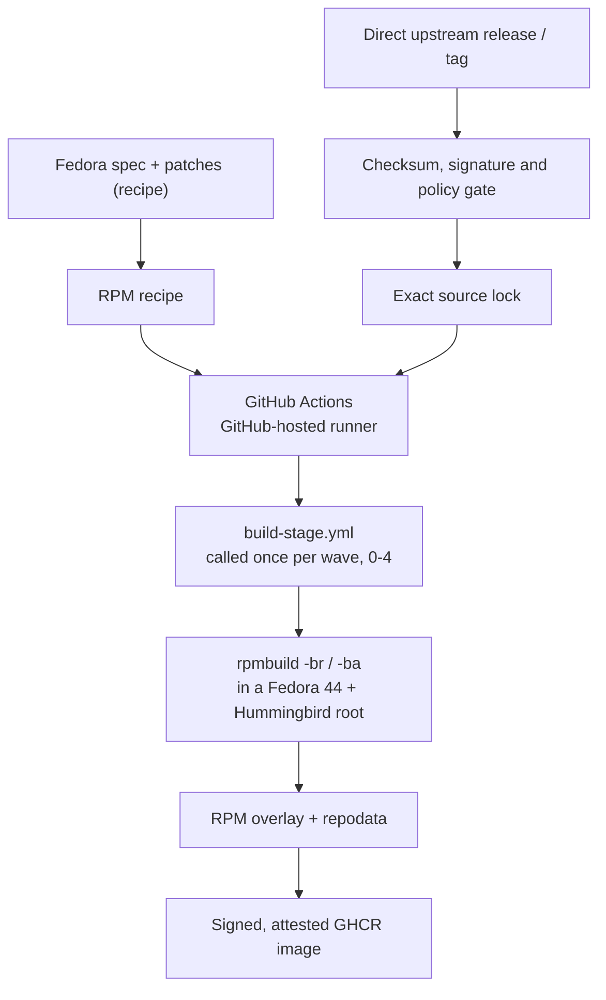

# Architecture



This factory is GitHub Actions' replacement for Copr. Fedora dist-git supplies
the recipe; the upstream release supplies the payload; source verification
precedes the build.

The previous architecture put execution on a remote Argo cluster with FSDK
containers and a local registry mirror. That was wrong; the execution model
is pure GitHub Actions. No external build service, cluster, or self-hosted
runner is part of this path.

Copr, Packit-as-a-Service, Koji, Bodhi, Testing Farm, Kubernetes, local Zot,
lab nodes, and self-hosted runners are not dependencies.

## Tooling

The target runner is GitHub-hosted `ubuntu-26.04`. The x64 and arm images
entered public preview on 2026-06-11
([announcement](https://github.blog/changelog/2026-06-11-new-runner-images-in-public-preview/)
and [runner image issue](https://github.com/actions/runner-images/issues/14226)).
For a public repository, the standard x64 runner provides 4 vCPUs, 16 GB of
RAM, 14 GB of SSD, and a six-hour job limit.

The current workflows still pin `ubuntu-24.04`. The migration to
`ubuntu-26.04` is outstanding; this document does not claim that it has
happened.

Package builds, generated-source reproduction, reproducibility probes, and
environment-sensitive validation run in GitHub Actions, in a container the
workflow starts with `docker run`.

**Which container is not what `AGENTS.md` says it is, and this is a live
contradiction rather than a nuance.** `AGENTS.md` requires the digest-pinned
`quay.io/packit/packit` image, and forbids replacing that digest with a
mutable tag. What actually builds every RPM is:

| workflow | container | pinned? |
| --- | --- | --- |
| `build-stage.yml` — the binary lane | `quay.io/fedora/fedora:44` | no, a mutable tag |
| `rebuild-rpms.yml` — `preflight`, `precedence` | `quay.io/fedora/fedora:44` | no, a mutable tag |
| `packit-srpm-pilot.yml` — verification only, feeds nothing | `quay.io/packit/packit@sha256:8a178425…` | yes |
| `recalculate-hummingbird-gaps.yml` | `quay.io/hummingbird-community/bootc-os:latest` | no, a mutable tag |

So the only workflow honouring the rule is the one that produces nothing, and
the rule's own prohibition — a mutable tag — describes every real build.

The rule is not arbitrary and is not a leftover. `docs/superpowers/specs/`
carries an approved design in which Packit drives Mock, and the Packit image
was pinned precisely because it supplies `packit`, `mock` and `createrepo_c`
in one place. What the table shows is therefore an **unfinished
implementation**, not a wrong rule: the binary lane never got past hand-rolled
`rpmbuild` in a Fedora image. The mutable tag, the installed-but-unused mock,
and the hand-simulated build root are all the same gap seen from different
angles.

Whether to finish that design or supersede it is tracked in
[#43](https://github.com/projectbluefin/utah-packages/issues/43).

`.github/workflows/packit-srpm-pilot.yml` proves the SRPM path but is
verification-only and manual-dispatch-only: its full-inventory fan-out is not
a PR or merge check and its output is not published. Its `discover` job emits the package list from
`tools/packit_workflow.py packages`; its per-package `srpm` matrix has
`fail-fast: false` and is fanned out over chunks of 250 by
`tools/packit_workflow.py chunks`. The chunking is not cosmetic: GitHub caps a
matrix at 256 jobs and expands a larger one to nothing rather than rejecting
it, so once the monorepo passed 256 packages the pilot failed on every run with
a green `discover` above an `srpm` job that never existed. The `discover` guard
asserts the package list is non-empty, which a list of 397 satisfies while
still producing no jobs. Each matrix job uses `tools/source_pipeline.py` to fetch
and verify the configured sources and stage them beside the spec, then runs
`packit srpm --preserve-spec`. It uploads one SRPM artifact and stops there:
it does not feed the overlay or publication, and nothing consumes its output.

### What Packit is for here, and what it is not

Packit stays, scoped to what it is good at: **turning a recipe into an SRPM and
proving the spec is well formed.** Run against this monorepo it does that in
three or four seconds a package:

```text
flac-1.5.0-9.fc43      SRPM OK in 4s
libnice-0.1.23-3.fc43  SRPM OK in 4s
dracut-111-2.fc43      SRPM OK in 3s
```

That is worth having as a gate. A malformed spec fails in seconds rather than
after a build lane has installed a build root and compiled for minutes --
`dracut` sat behind a lowercase month in a `%changelog` date, the sort of thing
an SRPM step catches immediately.

Packit is **not** replacing the binary lane, and the disttags above say why.
`packit srpm` yields `flac-1.5.0-9.fc43`; this factory ships
`gnome-shell-extension-gsconnect-72-3.hum1.bfin`. The whole reason the factory
exists is to rebuild against Hummingbird so that sonames match the image it
feeds -- the staging work behind `libheif`, `abseil-cpp` and `ffmpeg` is
exactly that problem. A Fedora-chroot SRPM does not answer it.

**Copr is the shape in which Packit could take over the binary lane, and we are
not pursuing it now.** Packit builds binaries through `copr_build` jobs, and
Copr offers Fedora chroots; producing `hum1.bfin` RPMs would need a custom Copr
chroot carrying the Hummingbird repository, plus the exclusion rules the lane
scripts already encode (Fedora must not answer for what the factory rebuilds,
and one Hummingbird package must not answer for another -- see the ruby
default-gems conflict). That is a migration of the build root itself, not a
change of build driver. Recorded here so the option is not rediscovered from
scratch; tracked with the wider question in
[#43](https://github.com/projectbluefin/utah-packages/issues/43).

Two consequences worth stating plainly:

- Packit does not do source acquisition either. It logs *We are unable to
  download remote sources from spec-file ... skipping downloading of remote
  sources*, so `tools/source_pipeline.py` remains the only thing fetching and
  verifying upstream archives, in both lanes.
- `.packit.yaml` declares packages but carries **no `jobs:` section**, so the
  Packit service performs no work on a pull request. The manifest is a
  precondition for Copr builds, not evidence of them. The only thing exercising
  Packit is the pilot workflow.

The root Packit configuration and the source lock both cover all 397 recipes:

| check | result |
| --- | ---: |
| `ls -d packages/*/ \| wc -l` | `397` |
| entries under `.packit.yaml:packages` | `397` |
| entries under `config/upstream-sources.json:packages` | `397` |

`python3 tools/validate.py` reports:

```text
validated 397 source RPMs
```

## Current binary pipeline

`.github/workflows/rebuild-rpms.yml` is the current binary lane. Its
`prepare`, `preflight`, `precedence` and `publish` jobs, and the
`build-stage.yml` it calls, all run on `ubuntu-24.04`; the migration to
`ubuntu-26.04` remains open.

| job | verified behavior |
| --- | --- |
| `prepare` | Selects the packages that are new, changed, or requested by a full rebuild, then emits five stage lists. A package declaring a stage above 4 has no job to run in, so this fails and names it rather than dropping it. |
| `preflight` | Resolves BuildRequires for the selected packages in the real build root and uploads a worklist; it is `continue-on-error`. Its output is advisory: the waves are still driven by the hand-assigned `stage` in config, not by what this resolves. |
| `rebuild0` through `rebuild4` | Five calls to the reusable `build-stage.yml`, one per wave, each a `fail-fast: false` package matrix. Each later stage downloads the earlier workflow artifacts, creates a local `[stages]` dnf repository with `createrepo_c`, and resolves against it. |
| `precedence` | Checks that each produced RPM outranks what Fedora 44 and Hummingbird already offer, and reports any name Hummingbird also provides. |
| `publish` | Merges the stage artifacts, removes the bootstrap RPM, creates and signs repository metadata, validates the Hummingbird-only transaction, and publishes a GHCR OCI image that is both cosign-signed and provenance-attested. |

`.github/workflows/build-stage.yml` is the wave itself, and the only place a
package is built. It takes a stage number and a JSON list of packages; it
knows nothing about the other waves beyond the artifacts they left behind.
Ordering lives entirely in the caller.

The five dependency stages pass their output between jobs as workflow
artifacts. A later stage downloads those artifacts into `work/prior`, creates
the local `[stages]` repository there, and uses that repository for the
transaction; the artifact handoff and the dnf repository are both part of
the dependency mechanism.

Inside the Fedora 44 container, the workflow stages the verified source and
runs `rpmbuild -br` to resolve generated BuildRequires, followed by
`rpmbuild -ba` to produce the binary RPMs.

### Preserving completed package builds

Atomic repository publication and incremental work preservation are separate.
The consumer image advances only after the complete repository passes its
gates. Each successful package build is also written immediately to a
content-keyed OCI cache, so a later run can restore completed RPMs even when
the earlier run never published a repository. Restored RPMs follow the same
stage-artifact and final-gate path as freshly compiled RPMs.

The key binds the recipe, prepared build-root digest, prepare-time factory
digest, resolved build-root NEVRAs and disttag. Rebuild planning remains
authoritative: directly changed and stale packages are excluded from reuse.
The full rationale and invariants are in
[`docs/skills/package-build-cache.md`](skills/package-build-cache.md).

### Trigger and merge-queue policy

The full factory runs daily at `06:41 UTC` or by manual dispatch. Pull requests
and pushes to `main` do not launch it; they run the validation workflow below.
This deliberately batches multiple merges into one coherent repository build
instead of flooding the Actions queue with one package matrix per commit.

Merge queue is the next step only after repeated factory runs prove that cache
hits skip compilation and that successful packages survive a failed run. When
enabled, merge groups should require the fast validation workflow. After a
batch merges, run the factory once at the final `main` commit (or use the next
daily run), then atomically publish that batch. The operational rationale is
part of the cache contract in
[`docs/skills/package-build-cache.md`](skills/package-build-cache.md#merge-queue-rollout-and-batching).

### The pipeline canary

`.github/workflows/canary.yml` proves a pipeline change in minutes instead of
hours into a full run. It calls `rebuild-rpms.yml` itself through
`workflow_call`, so it runs the real jobs, over a fixed set: `libical` and
`vulkan-headers` at stage 0 and `vulkan-loader` at stage 4, which
BuildRequires `vulkan-headers = %{version}` -- only stage 0's output satisfies
it. Every source in the set is on the Fedora lookaside, so the canary fails on
the pipeline and not on a flaky upstream host.

| pass | what it proves |
| --- | --- |
| `pass1` | The set builds, passes precedence and a Hummingbird-only transaction over every binary it produced, and publishes, signs and attests `utah-packages:canary-<pr>`. Never `latest`. `verify-publish` then reads that digest with Utah's own `scripts/check-repo-availability.py`, fetched from Utah's `main`, asserts two layers with repodata first, and verifies the signature and provenance. |
| `pass2` | The same set again compiles nothing: every build is a cache hit, so the key is stable from one run to the next. |
| `pass3` | The same set plus `python-typing-inspection` with its recipe perturbed in the checkout: that one compiles and every other package still hits, so one package's change does not invalidate the cache wholesale. |

The cache is salted with a digest of the build path (`tools/canary.py
salt`), so a change to how packages are compiled compiles for real in
`pass1`, and any other change reuses the previous canary's builds. Canary
entries never share a key with production ones: an empty salt leaves the
production key unchanged, which `tests/test_package_cache_key.py` asserts.

It runs on every pull request. The `Canary` job is the required check and
passes without building anything when no pipeline path changed
(`.github/workflows/`, `.github/actions/`, `tools/`, `config/`,
`Containerfile*`). Do not dispatch a full run to prove a pipeline change
before the canary is green on it.

It is not a mock build, and this is the most misleading thing about the file:
`build-stage.yml` installs `mock` and never invokes it, then hand-simulates
what mock would have set up. Its own comments say so — *"mirroring Hummingbird
mock.cfg"*, *"the plain fedora image is not a build root: it lacks the group
mock installs"*, *"mock defines USER in its build root; a bare container does
not"*. So there is no clean root per build, no hermetic mode, and no reset
between packages. Moving to real mock is agreed and unbuilt; see below.

## Repository gates

The repository gates are enforced across CI workflows and collected in `Justfile`:

| Gate | Command | Enforced in | What it gates |
| --- | --- | --- | --- |
| Factory onboarding contract | `tools/factory_contract.py` | `.github/workflows/validate.yml` | Skill router coverage, skill front-matter, the `AGENTS.md` self-improvement mandate, the pinned `projectbluefin/common` sidecar, banned changelog and session-notes files, and relative documentation links |
| Package factory configuration | `tools/validate.py` | `.github/workflows/validate.yml` | Import provenance in `.hummingbird-upstream.json`, source-lock coverage, and Packit configuration for every recipe |
| Workflow shell quoting | `tools/check_workflow_quoting.py` | `.github/workflows/rebuild-rpms.yml` (`prepare`) | Shell-quoting safety of build scripts embedded in GitHub Actions workflows |
| Runtime contract | `tools/runtime_contract.py config/bluefin-packages.toml config/runtime-contract.toml --check` | `.github/workflows/rebuild-rpms.yml` (`prepare`) | Image manifest resolution against the pinned Hummingbird runtime contract |
| Unit tests | `pytest tests` / `unittest discover` | `.github/workflows/validate.yml`, `.github/workflows/rebuild-rpms.yml` (`prepare`) | The tooling in `tools/`, including `tools/publish_gate.py`, whose regression test asserts the rebuild-rpms.yml publish job stays gated so a failed build, precedence, or unresolved Hummingbird-only transaction cannot partially replace the published factory |

`just check` runs all five gates (`factory-check`, `validate`, `workflow-quoting`,
`runtime-contract`, `test`), and `tests/test_gate_catalog.py` structurally
asserts that the documented local gate and CI agree on the enforced gate set in
both directions. `just test` remains available to run the test suite on its own,
and `pre-commit run --all-files` adds YAML, JSON, and TOML hygiene plus
actionlint and the SHA-pinning rule for third-party actions. None of these
publish anything; publication gates live in the rebuild and compose workflows.

## Agreed direction, not yet built

Recorded from a design review against Hummingbird's own factory. The sections
above describe what the workflows do; everything below is decided and unbuilt.
Each row states the decision and the evidence that motivated it, so a later
reader can tell a considered choice from an accident. Decisions that have since
been implemented are described above, in the present tense, rather than kept
here as a list of completed work.

| Decision | Today | Agreed | Why |
| --- | --- | --- | --- |
| **Scope** | "the desktop stack Hummingbird does not ship" | Everything above the base OS that Bluefin's contract needs; never Hummingbird's toolchain | Utah is Bluefin recreated on Hummingbird, and we package it ourselves. Owning an ABI inside a six-hour runner is not a job worth taking from people who do it well. |
| **Hummingbird overlap** | `precedence` reports any shared package name as a mistake | Allowed, but declared per package in `config/upstream-sources.json` | A general factory legitimately rebuilds things Hummingbird also ships. Undeclared overlap is still a mistake. |
| **Build engine** | Bare `rpmbuild -br` then `-ba`, in a container that hand-simulates a build root | Mock, hermetic where possible | `build-stage.yml` installs `mock` and never invokes it, then reimplements it: *"mirroring Hummingbird mock.cfg"*, *"mock defines USER in its build root; a bare container does not"*. Hummingbird builds in mock, and so does the approved design in `docs/superpowers/specs/`, which this review reached independently. Whether Packit drives it is the open part — [#43](https://github.com/projectbluefin/utah-packages/issues/43). |
| **Buildroot** | Solved live against whatever the repos serve at that moment | Resolve once, write `buildroot_lock.json` as a run artifact, build offline from it | Hummingbird's mechanism: `rpmspec --buildrequires` → DNF solve → `buildroot_lock.json` → hermetic repo → `--network=none` (`ci/build_rpms.sh`). Records EVR, arch, repo ID, URL, checksum and source RPM — not names. It is why the ABI question has an answer instead of a log grep. |
| **Stage assignment** | 87 of 397 packages carry a hand-assigned `stage` | Solve waves from real BuildRequires; config `stage` demotes to an override for cycle-breakers such as `malcontent-bootstrap` | `preflight` already resolves every recipe's BuildRequires and then discards the result. Hand integers are a manual cache of a computed value; two of them were discovered by a build failing. Hummingbird has no stage numbers at all — it is solver-driven plus a reverse-dependency impact scanner. |
| **Compiler cache** | `sccache` against the Actions cache service, over the network | Mock's `ccache` plugin plus `actions/cache`; delete `.github/actions/setup-sccache` | Hermetic mock is network-isolated. sccache would degrade to a total miss and look like "builds got slower" rather than failing. |
| **Architecture** | `x86_64` hardcoded in the Hummingbird repository id and the sccache URL | Stay x86_64 only | Deferred deliberately, not overlooked. |
| **Fork state** | `.hummingbird-upstream.json` pins a Fedora commit and tree; drift is invisible | Compute drift against the pinned commit in CI; an undeclared diff fails | Hummingbird labels every package `clean`, `modified` or `independent` and requires a reason for `modified`. Computed rather than declared, so it cannot rot the way the stage integers did. The recorded `tree` cannot be recomputed offline: the import drops files dist-git carries, so pango records tree `bdf8be16` while its three imported files hash to `f80aca67`, the difference being `.gitignore`. Drift detection has to fetch the pinned commit rather than rehash the working tree. |
| **Ship the lock** | The published image contains only `repository/` | Ship `buildroot_lock.json` inside it beside the RPMs | Provenance now records what built the image; the lock is what records what went into the packages. Waits on the lockfile above. |
| **Tooling shape** | 14 scripts in `tools/`, plus workflows that hand-edit config | One authoritative CLI | Hummingbird's `ci/dist_git.py` owns import, update, sync, rebuild, rename and metadata. Their single most transferable practice. |

These rows are a design review's conclusions, and one of them collides with an
already-approved design: `docs/superpowers/specs/` describes a Packit-driven
Mock factory approved by the maintainer, which this review did not account for.
Both agree the build belongs in mock. They differ on whether Packit drives it,
and that difference decides the build container and the fate of roughly 1,445
lines of Packit configuration and tooling. It is
[#43](https://github.com/projectbluefin/utah-packages/issues/43), and nothing
here acts on it.
