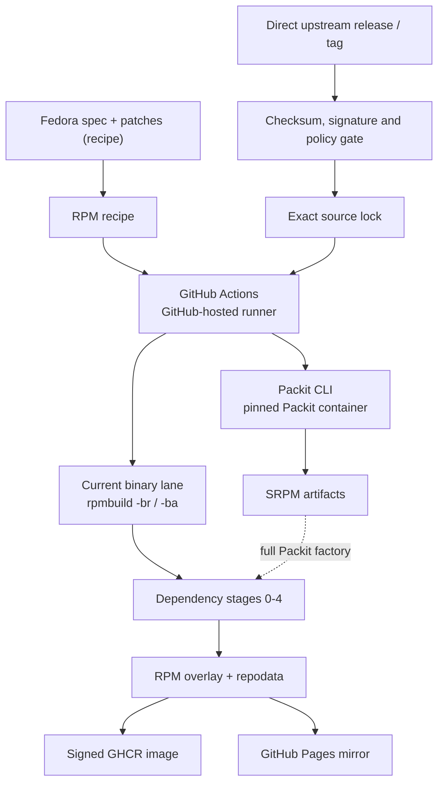

# Architecture



This factory is GitHub Actions' replacement for Copr. Packit runs as a CLI
inside workflow jobs, not as a hosted Packit service or a separate build
farm. Fedora dist-git supplies the recipe; the upstream release supplies the
payload; source verification precedes either build path.

The previous architecture put execution on a remote Argo cluster with FSDK
containers and a local registry mirror. That was wrong; the execution model
is pure GitHub Actions. No external build service, cluster, or self-hosted
runner is part of this path.

Copr, Packit-as-a-Service, Koji, Bodhi, Testing Farm, Kubernetes, local Zot,
lab nodes, and self-hosted runners are not dependencies.

## Tooling

The target runner is GitHub-hosted `ubuntu-26.04`. The x64 and arm images
entered public preview on 2026-06-11
([announcement](https://github.blog/changelog/2026-06-11-new-runner-images-in-public-preview/)
and [runner image issue](https://github.com/actions/runner-images/issues/14226)).
For a public repository, the standard x64 runner provides 4 vCPUs, 16 GB of
RAM, 14 GB of SSD, and a six-hour job limit.

The current workflows still pin `ubuntu-24.04`. The migration to
`ubuntu-26.04` is outstanding; this document does not claim that it has
happened.

Package builds, generated-source reproduction, reproducibility probes, and
environment-sensitive validation run in GitHub Actions inside the
digest-pinned `quay.io/packit/packit` container. The container is the build
environment and owns the toolchain. Do not install packages into it at
runtime, replace the digest with a mutable tag, or substitute a generic
distro image. The Packit image is the build container, not an exception to a
retired container rule.

The current Packit image digest is
`quay.io/packit/packit@sha256:149e6e06d3e5fb2f10d19760c8a0031c7d8825e7bb91a5f4a7ab9b927c947494`.

`.github/workflows/packit-srpm-pilot.yml` proves the SRPM path but is
verification-only. Its `discover` job emits the package list from
`tools/packit_workflow.py packages`. Its per-package `srpm` matrix has
`fail-fast: false`. The workflow currently runs those jobs on `ubuntu-24.04`.
Each matrix job uses `tools/source_pipeline.py` to fetch and verify the
configured sources and stage them beside the spec, then runs
`packit srpm --preserve-spec` inside the pinned Packit container. It runs a
post-command `--verify-staged packages` check, guards the output with `test -s`, and
uploads one SRPM artifact with `if-no-files-found: error`. It does not feed
Mock, the overlay, or publication.

The old pilot description said that it covered 54 packages with inherited
Fedora Packit configuration. That was wrong. The root configuration and
source lock cover all 193 recipes:

| check | result |
| --- | ---: |
| `ls -d packages/*/ \| wc -l` | `193` |
| entries under `.packit.yaml:packages` | `193` |
| entries under `config/upstream-sources.json:packages` | `193` |

`python3 tools/validate.py` reports:

```text
validated 193 source RPMs
```

## Current binary pipeline

`.github/workflows/rebuild-rpms.yml` is the current binary lane. Its
`prepare`, `preflight`, `rebuild0` through `rebuild4`, `precedence`, and
`publish` jobs currently all use `ubuntu-24.04`; the runner migration remains
open.

| job | verified behavior |
| --- | --- |
| `prepare` | Selects the packages that are new, changed, or requested by a full rebuild, then emits five stage lists. |
| `preflight` | Resolves BuildRequires for the selected packages in the real build root and uploads a worklist; it is `continue-on-error`. |
| `rebuild0` through `rebuild4` | Builds each stage in a `fail-fast: false` package matrix. Each later stage downloads the earlier workflow artifacts, creates a local `[stages]` dnf repository with `createrepo_c`, and resolves against it. |
| `precedence` | Checks that each produced RPM outranks what Fedora 44 and Hummingbird already offer. |
| `publish` | Merges the stage artifacts, removes the bootstrap RPM, creates and signs repository metadata, validates the Hummingbird-only transaction, and publishes a signed GHCR OCI image. A main-branch-only `publish_pages` job provides the Pages mirror. |

The five dependency stages pass their output between jobs as workflow
artifacts. A later stage downloads those artifacts into `work/prior`, creates
the local `[stages]` repository there, and uses that repository for the
transaction; the artifact handoff and the dnf repository are both part of
the dependency mechanism.

The binary build is not Packit yet. Inside the current Fedora 44 container,
the workflow stages the verified source and runs hand-rolled `rpmbuild -br`
to resolve generated BuildRequires, followed by `rpmbuild -ba` to produce the
binary RPMs. Replacing that block with the Packit factory is the remaining
binary-build gap; the SRPM pilot does not close it.

## Repository gates

`.github/workflows/validate.yml` runs on every pull request and every push to
`main`, in three independent jobs:

| Job | Command | Gates |
| --- | --- | --- |
| Factory onboarding contract | `tools/factory_contract.py` | Skill router coverage, skill front-matter, the `AGENTS.md` self-improvement mandate, the pinned `projectbluefin/common` sidecar, banned changelog and session-notes files, and relative documentation links |
| Package factory configuration | `tools/validate.py` | Import provenance in `.hummingbird-upstream.json`, source-lock coverage, and Packit configuration for every recipe |
| Unit tests | `pytest tests` | The tooling in `tools/` |

`just check` runs the first two, `just test` the third, and
`pre-commit run --all-files` adds YAML, JSON, and TOML hygiene plus actionlint
and the SHA-pinning rule for third-party actions. None of these publish
anything; publication gates live in the rebuild and compose workflows.
