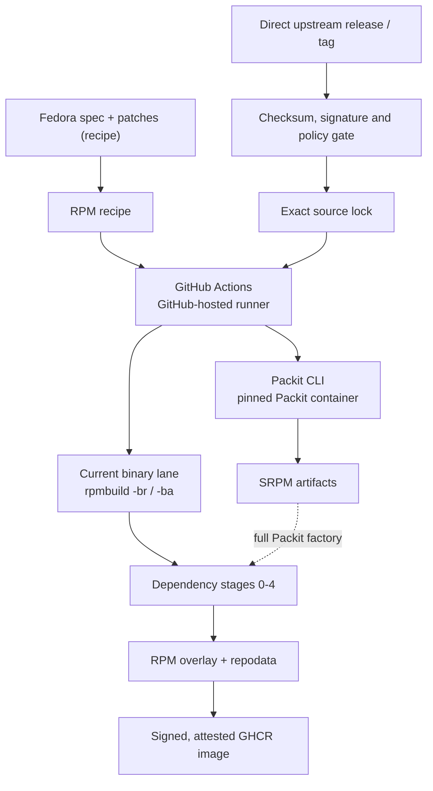

# Architecture



This factory is GitHub Actions' replacement for Copr. Packit runs as a CLI
inside workflow jobs, not as a hosted Packit service or a separate build
farm. Fedora dist-git supplies the recipe; the upstream release supplies the
payload; source verification precedes either build path.

The previous architecture put execution on a remote Argo cluster with FSDK
containers and a local registry mirror. That was wrong; the execution model
is pure GitHub Actions. No external build service, cluster, or self-hosted
runner is part of this path.

Copr, Packit-as-a-Service, Koji, Bodhi, Testing Farm, Kubernetes, local Zot,
lab nodes, and self-hosted runners are not dependencies.

## Tooling

The target runner is GitHub-hosted `ubuntu-26.04`. The x64 and arm images
entered public preview on 2026-06-11
([announcement](https://github.blog/changelog/2026-06-11-new-runner-images-in-public-preview/)
and [runner image issue](https://github.com/actions/runner-images/issues/14226)).
For a public repository, the standard x64 runner provides 4 vCPUs, 16 GB of
RAM, 14 GB of SSD, and a six-hour job limit.

The current workflows still pin `ubuntu-24.04`. The migration to
`ubuntu-26.04` is outstanding; this document does not claim that it has
happened.

Package builds, generated-source reproduction, reproducibility probes, and
environment-sensitive validation run in GitHub Actions inside the
digest-pinned `quay.io/packit/packit` container. The container is the build
environment and owns the toolchain. Do not install packages into it at
runtime, replace the digest with a mutable tag, or substitute a generic
distro image. The Packit image is the build container, not an exception to a
retired container rule.

The current Packit image digest is
`quay.io/packit/packit@sha256:149e6e06d3e5fb2f10d19760c8a0031c7d8825e7bb91a5f4a7ab9b927c947494`.

`.github/workflows/packit-srpm-pilot.yml` proves the SRPM path but is
verification-only. Its `discover` job emits the package list from
`tools/packit_workflow.py packages`. Its per-package `srpm` matrix has
`fail-fast: false`. The workflow currently runs those jobs on `ubuntu-24.04`.
Each matrix job uses `tools/source_pipeline.py` to fetch and verify the
configured sources and stage them beside the spec, then runs
`packit srpm --preserve-spec` inside the pinned Packit container. It runs a
post-command `--verify-staged packages` check, guards the output with `test -s`, and
uploads one SRPM artifact with `if-no-files-found: error`. It does not feed
Mock, the overlay, or publication.

The old pilot description said that it covered 54 packages with inherited
Fedora Packit configuration. That was wrong. The root configuration and
source lock cover all 193 recipes:

| check | result |
| --- | ---: |
| `ls -d packages/*/ \| wc -l` | `193` |
| entries under `.packit.yaml:packages` | `193` |
| entries under `config/upstream-sources.json:packages` | `193` |

`python3 tools/validate.py` reports:

```text
validated 193 source RPMs
```

## Current binary pipeline

`.github/workflows/rebuild-rpms.yml` is the current binary lane. Its
`prepare`, `preflight`, `rebuild0` through `rebuild4`, `precedence`, and
`publish` jobs currently all use `ubuntu-24.04`; the runner migration remains
open.

| job | verified behavior |
| --- | --- |
| `prepare` | Selects the packages that are new, changed, or requested by a full rebuild, then emits five stage lists. |
| `preflight` | Resolves BuildRequires for the selected packages in the real build root and uploads a worklist; it is `continue-on-error`. |
| `rebuild0` through `rebuild4` | Each calls the reusable `build-stage.yml` for one wave, in a `fail-fast: false` package matrix. Each later stage downloads the earlier workflow artifacts, creates a local `[stages]` dnf repository with `createrepo_c`, and resolves against it. |
| `precedence` | Checks that each produced RPM outranks what Fedora 44 and Hummingbird already offer. |
| `publish` | Merges the stage artifacts, removes the bootstrap RPM, creates and signs repository metadata, validates the Hummingbird-only transaction, and publishes a signed GHCR OCI image with build provenance attested. |

The five dependency stages pass their output between jobs as workflow
artifacts. A later stage downloads those artifacts into `work/prior`, creates
the local `[stages]` repository there, and uses that repository for the
transaction; the artifact handoff and the dnf repository are both part of
the dependency mechanism.

The binary build is not Packit yet. Inside the current Fedora 44 container,
the workflow stages the verified source and runs hand-rolled `rpmbuild -br`
to resolve generated BuildRequires, followed by `rpmbuild -ba` to produce the
binary RPMs. Replacing that block with the Packit factory is the remaining
binary-build gap; the SRPM pilot does not close it.

## Repository gates

`.github/workflows/validate.yml` runs on every pull request and every push to
`main`, in three independent jobs:

| Job | Command | Gates |
| --- | --- | --- |
| Factory onboarding contract | `tools/factory_contract.py` | Skill router coverage, skill front-matter, the `AGENTS.md` self-improvement mandate, the pinned `projectbluefin/common` sidecar, banned changelog and session-notes files, and relative documentation links |
| Package factory configuration | `tools/validate.py` | Import provenance in `.hummingbird-upstream.json`, source-lock coverage, and Packit configuration for every recipe |
| Unit tests | `pytest tests` | The tooling in `tools/` |

`just check` runs the first two, `just test` the third, and
`pre-commit run --all-files` adds YAML, JSON, and TOML hygiene plus actionlint
and the SHA-pinning rule for third-party actions. None of these publish
anything; publication gates live in the rebuild and compose workflows.

## Agreed direction, not yet built

Recorded from a design review against Hummingbird's own factory. None of this
is implemented; the sections above describe what the workflows actually do
today. Each row states the decision and the evidence that motivated it, so a
later reader can tell a considered choice from an accident.

| Decision | Today | Agreed | Why |
| --- | --- | --- | --- |
| **Scope** | "the desktop stack Hummingbird does not ship" | Everything above the base OS that Bluefin's contract needs; never Hummingbird's toolchain | Utah is Bluefin recreated on Hummingbird, and we package it ourselves. Owning an ABI inside a six-hour runner is not a job worth taking from people who do it well. |
| **Hummingbird overlap** | `precedence` reports any shared package name as a mistake | Allowed, but declared per package in `config/upstream-sources.json` | A general factory legitimately rebuilds things Hummingbird also ships. Undeclared overlap is still a mistake. |
| **Build engine** | Bare `rpmbuild -br` then `-ba`, in a container that hand-simulates a build root | Mock, hermetic where possible | `rebuild-rpms.yml` installs `mock` five times and never invokes it, then reimplements it: *"mirroring Hummingbird mock.cfg"*, *"mock defines USER in its build root; a bare container does not"*. Hummingbird builds in mock. |
| **Buildroot** | Solved live against whatever the repos serve at that moment | Resolve once, write `buildroot_lock.json` as a run artifact, build offline from it | Hummingbird's mechanism: `rpmspec --buildrequires` → DNF solve → `buildroot_lock.json` → hermetic repo → `--network=none` (`ci/build_rpms.sh`). Records EVR, arch, repo ID, URL, checksum and source RPM — not names. It is why the ABI question has an answer instead of a log grep. |
| **Stage assignment** | 31 of 193 packages carry a hand-assigned `stage` | Solve waves from real BuildRequires; config `stage` demotes to an override for cycle-breakers such as `malcontent-bootstrap` | `preflight` already resolves every recipe's BuildRequires and then discards the result. Hand integers are a manual cache of a computed value; two of them were discovered by a build failing. Hummingbird has no stage numbers at all — it is solver-driven plus a reverse-dependency impact scanner. |
| **Stage jobs** | ~~Five near-identical ~205-line copies~~ **Done.** One reusable workflow, called five times | Four lines of substantive difference between stage 0 and stage 1. `rebuild-rpms.yml` fell from 1,570 to 567 lines. The firefox swap workaround had existed only in stage 0, so it would have stopped applying the moment firefox was solved into another wave; it now applies to every wave. `prepare` also silently dropped any package asking for a stage above 4 while leaving it in `build_list`, publishing a repository quietly missing it — that now fails. |
| **Compiler cache** | `sccache` against the Actions cache service, over the network | Mock's `ccache` plugin plus `actions/cache`; delete `.github/actions/setup-sccache` | Hermetic mock is network-isolated. sccache would degrade to a total miss and look like "builds got slower" rather than failing. |
| **Architecture** | `x86_64` hardcoded in the repo name and the sccache URL | Stay x86_64 only | Deferred deliberately, not overlooked. |
| **Pages mirror** | ~~`publish_pages`, main-only~~ **Done.** Deleted, with the `pages: write` permission and the artifact handoff that fed it | Utah consumes the OCI digest. Pages existed because the registry path did not yet, and it now does. Nothing read it. |
| **Provenance** | ~~`cosign sign` only~~ **Partly done.** `actions/attest-build-provenance` now runs on the published image, pushed to the registry. Shipping `buildroot_lock.json` inside the image waits on the lockfile | A signature says the image came from here; provenance says what built it, which is the question asked after a bad package ships. The now-deleted `compose-base.yml` attested a base image; the path publishing what Utah installs did not. |
| **Fork state** | `.hummingbird-upstream.json` pins a Fedora commit and tree; drift is invisible | Compute drift against the pinned commit in CI; an undeclared diff fails | Hummingbird labels every package `clean`, `modified` or `independent` and requires a reason for `modified`. Computed rather than declared, so it cannot rot the way the stage integers did. **Note for whoever builds this:** the recorded `tree` cannot be recomputed from `packages/<name>/` offline. Import drops files dist-git carries — pango records tree `bdf8be16` but the imported three files hash to `f80aca67`, because `.gitignore` was not imported. Drift detection has to fetch the pinned commit, not rehash what is in tree. |
| **Release bumping** | ~~24 lines, no baseline~~ **Done.** `dist_bump` is now `{"count": N, "baseline": "<Release:>"}`, and the counter retires when Fedora's release moves | The old shape could not say which release it was counted against, so a stale `.1` would have claimed a rebuild that never happened. A `Release:` built from macros is refused rather than compared, as Hummingbird refuses `krb5_release` and nodejs. Covered by `tests/test_dist_bump.py`. |
| **Dead base lane** | ~~`compose-base.yml` plus `containers/base`~~ **Done.** Deleted | It had never run once. Its `workflow_run` trigger named "Rebuild Rawhide RPMs", a workflow that does not exist; it labelled itself `hanthor/hummingbird-github`; it set `gpgcheck=1` against RPMs this factory does not GPG-sign; it built on a Rawhide bootc base, the ABI this repository documents as wrong; and its only package input was the Pages URL removed above. |
| **Tooling shape** | 14 scripts in `tools/`, plus workflows that hand-edit config | One authoritative CLI | Hummingbird's `ci/dist_git.py` owns import, update, sync, rebuild, rename and metadata. Their single most transferable practice. |

### Open, escalated, not decided

Deleting the SRPM pilot orphans the whole Packit layer: `.packit.yaml`
(1,164 lines, 193 entries), `tools/render_packit_config.py`,
`tools/packit_source0.py`, `tools/packit_workflow.py`, and the
`validate.py` gate that requires Packit configuration for every recipe — a
gate on a file nothing else reads.

That is roughly 1,445 lines, and it collides with a hard rule: `AGENTS.md`
mandates `quay.io/packit/packit` as the pinned build container. With Packit
unused, that container is a Fedora image that happens to carry mock. The rule
worth keeping is *one digest-pinned container owns the toolchain*; which
container is an implementation detail, and
`quay.io/hummingbird-ci/hummingbird-builder` is arguably the more correct pin.

Amending a hard rule in `AGENTS.md` is a human decision. Nothing here acts on
it.
